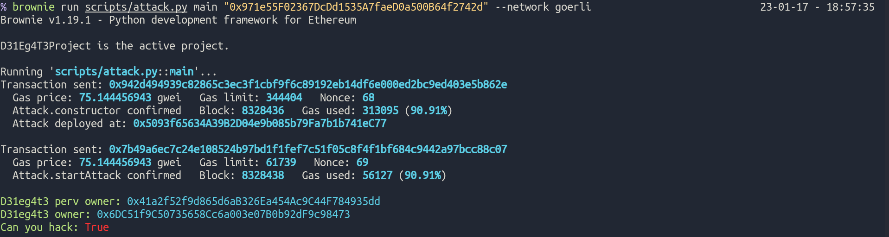

# D31eg4t3 quillctf

> Saikat Karmakar | 16 Jan 2022

## [D31eg4t3 Link](https://quillctf.super.site/challenges/quillctf-challenges/d31eg4t3)

# Description:

This CTF challenge is developed to showcase the vulnerability which can be introduced by using delegatecall() incorrectly.

“Handle with care, It’s D31eg4t3”

# How to Submit Solution:

Use the below submission form to submit the solution:
https://quillaudits.typeform.com/QuillCTF

# Objective of CTF

Become the owner of the contract.
Make canYouHackMe mapping to true for your own
address.

Note: You can create POCs using Foundry or Hardhat. Without proper POC, your submissions will not be accepted.

- Georli Link: 0x971e55f02367dcdd1535a7faed0a500b64f2742d

# How to solve

```bash
# run locally
brownie run scripts/attack.py

# run on goerli
brownie run scripts/attack.py main "0x971e55F02367DcDd1535A7faeD0a500B64f2742d" --network goerli
```

# POC


